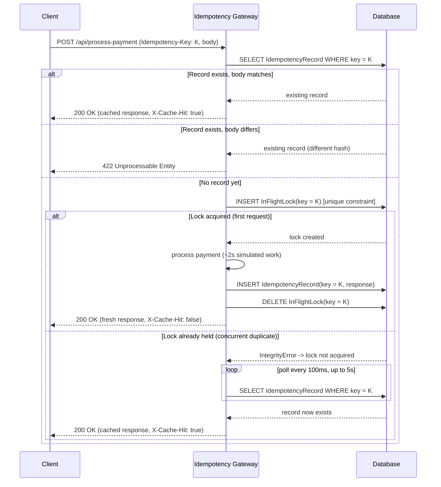

# Idempotency Gateway (The "Pay-Once" Protocol)

A Django REST Framework service that protects a payment endpoint from double-charging
when clients retry requests after network timeouts. Callers attach an `Idempotency-Key`
header; the gateway guarantees the underlying payment logic runs **exactly once** per key.

## 1. Architecture / Sequence Diagram



## 2. Setup Instructions

```bash
cd backend/Idempotency-gateway/finsafe
python -m venv venv
source venv/bin/activate        # Windows: venv\Scripts\activate
pip install -r requirements.txt

python manage.py migrate
python manage.py runserver
```

The API is served at `http://127.0.0.1:8000/`.

## 3. API Documentation

### `POST /api/process-payment`

**Headers**

| Header             | Required | Description                          |
|---------------------|----------|--------------------------------------|
| `Idempotency-Key`    | Yes      | Unique client-generated string identifying this transaction attempt. |
| `Content-Type`       | Yes      | `application/json`                   |

**Body**

```json
{ "amount": 100, "currency": "GHS" }
```

`currency` must be one of `GHS, USD, EUR, GBP, NGN, KES`.

**Responses**

| Scenario | Status | Body | Extra headers |
|---|---|---|---|
| First request | `200 OK` | `{"status": "Charged 100.00 GHS", "transaction_id": "...", ...}` | `X-Cache-Hit: false` |
| Retry, same key + same body | `200 OK` | Identical to the first response | `X-Cache-Hit: true` |
| Same key, different body | `422 Unprocessable Entity` | `{"error": "Idempotency key already used for a different request body."}` | — |
| Missing `Idempotency-Key` header | `400 Bad Request` | `{"error": "Idempotency-Key header is required"}` | — |
| Invalid body (bad amount/currency) | `400 Bad Request` | `{"error": "Invalid request body: ..."}` | — |
| Key expired (>10 min old) | `410 Gone` | `{"error": "Idempotency key expired"}` | — |
| Concurrent duplicate exceeds 5s wait | `504 Gateway Timeout` | `{"error": "Request processing timeout. Please try again."}` | — |

**Example**

```bash
curl -X POST http://127.0.0.1:8000/api/process-payment \
  -H "Content-Type: application/json" \
  -H "Idempotency-Key: order-42" \
  -d '{"amount": 100, "currency": "GHS"}'
```

### `GET /api/health`

Returns service status:

```json
{ "status": "OK", "service": "Idempotency Gateway", "timestamp": 1234567890.1, "version": "1.0.0" }
```

## 4. Design Decisions

- **Database-backed idempotency store (`IdempotencyRecord`).** SQLite (via Django ORM) keeps the
  solution dependency-free and swaps to Postgres/MySQL in production by changing one setting.
- **Request body hashing.** Instead of storing and diffing raw payloads, the gateway hashes the
  request body (`sha256` of the sorted JSON) and compares hashes. This makes the "same key,
  different body" check (User Story 3) cheap and deterministic regardless of key ordering.
- **Locking via a unique DB constraint, not an app-level mutex.** The bonus "in-flight" requirement
  (two identical requests arriving at once) is solved with an `InFlightLock` row whose
  `idempotency_key` column is `unique`. The *first* `INSERT` wins atomically at the database level;
  the second raises an `IntegrityError`, which the service treats as "someone else is already
  processing this key." This works correctly even across multiple app server processes/workers,
  unlike an in-memory lock (e.g. Django's local-memory cache), which is only visible within a
  single process and would let two workers each believe they hold the lock.
- **Polling instead of blocking on a condition variable.** The losing request polls the database
  every 100ms (up to 5s) for the winning request's result. This avoids extra infrastructure
  (message queues, pub/sub) while still satisfying "Request B should wait, not fail" — a pragmatic
  trade-off for a service of this size.

## 5. Developer's Choice: Automatic Key Expiration + Cleanup

**Feature added:** every `IdempotencyRecord` is stored with a 10-minute `expires_at`. A request
that reuses a key after it has expired gets a clear `410 Gone` instead of silently being treated
as a fresh payment or incorrectly replayed forever. A `cleanup_idempotency` management command
(`python manage.py cleanup_idempotency --days 7`) purges old records, so the table doesn't grow
unbounded — intended to run as a daily cron/scheduled task in production.

**Why this matters for FinSafe:** in a real payment gateway, idempotency keys are usually scoped to
a short retry window (minutes, not forever) — reusing a key from a completed order weeks later is a
bug on the client side, not a legitimate retry, and should be rejected rather than blindly replayed.
Expiration bounds both the *storage* growth (which is a real cost at payment-processor scale) and
the *blast radius* of a leaked or reused key, without requiring an external cache/TTL store.

## 6. Project Structure

```
finsafe/
├── manage.py
├── requirements.txt
├── finsafe/          # project settings, urls
└── payments/
    ├── models.py       # IdempotencyRecord, InFlightLock
    ├── serializers.py  # request/response validation
    ├── services.py     # core idempotency + locking logic
    ├── views.py         # ProcessPaymentView, HealthCheckView
    ├── admin.py
    └── management/commands/cleanup_idempotency.py
```
