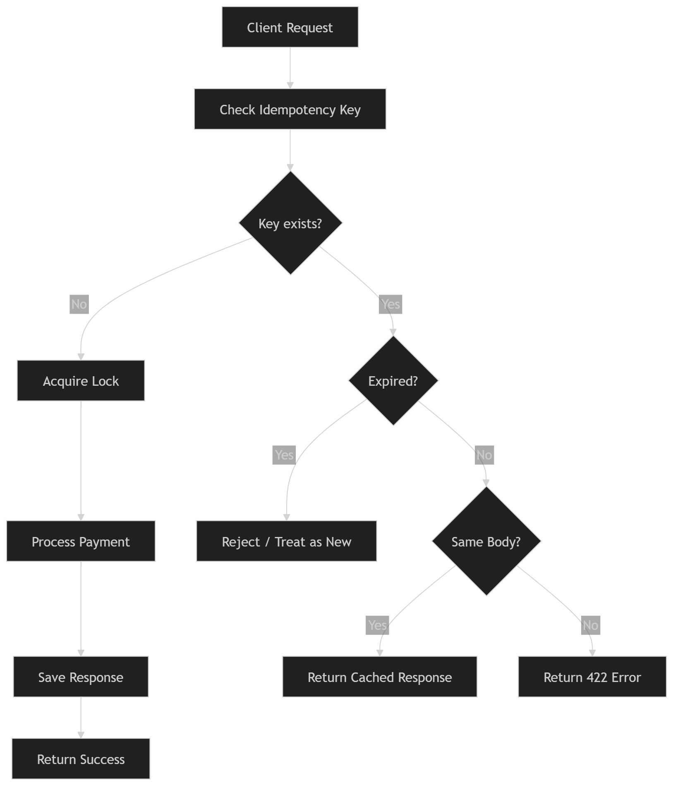

# Idempotency Gateway (The "Pay-Once" Protocol)

A Django REST Framework service I built that protects a payment endpoint from double-charging
when clients retry requests after network timeouts. Callers attach an `Idempotency-Key` header,
and the gateway guarantees the underlying payment logic runs **exactly once** per key — even if
the exact same request arrives twice at the same time.

## What I Implemented

- A `POST /api/process-payment` endpoint that requires an `Idempotency-Key` header and a JSON body
  (`amount`, `currency`).
- A `IdempotencyRecord` model that stores the key, a hash of the request body, and the response, so
  a retry with the **same** key + body returns the cached response instead of re-charging.
- A `422` rejection when the **same** key is reused with a **different** body (misuse, not a retry).
- An `InFlightLock` model, backed by a unique DB constraint, so that two identical requests arriving
  at the same instant don't both get processed — the second one polls and waits for the first one's
  result instead of racing it.
- Automatic key expiration (10 minutes) plus a `cleanup_idempotency` management command to purge old
  records — my "developer's choice" addition, described below.

## Diagrams

### Decision Flow

How one request is routed: no existing key means genuinely new work; an existing key is either
expired (treated as new), a valid retry (served from cache), or reused with a different body
(rejected with `422`).



### Request Sequence

How the pieces talk to each other for one request — API layer, idempotency service, DB, and the
in-flight lock that makes concurrent duplicates wait instead of double-charging.


## Setup

```bash
python -m venv venv
source venv/bin/activate        # Windows: venv\Scripts\activate
pip install -r requirements.txt

python manage.py migrate
python manage.py runserver
```

The API is served at `http://127.0.0.1:8000/`.

## API

### `POST /api/process-payment`

**Headers:** `Idempotency-Key` (required), `Content-Type: application/json`

**Body:** `{ "amount": 100, "currency": "GHS" }` — currency is one of `GHS, USD, EUR, GBP, NGN, KES`.

| Scenario | Status |
|---|---|
| First request | `200 OK` (`X-Cache-Hit: false`) |
| Retry, same key + same body | `200 OK`, identical response (`X-Cache-Hit: true`) |
| Same key, different body | `422 Unprocessable Entity` |
| Missing `Idempotency-Key` | `400 Bad Request` |
| Invalid body | `400 Bad Request` |
| Key expired (>10 min) | `410 Gone` |
| Concurrent duplicate exceeds 5s wait | `504 Gateway Timeout` |

```bash
curl -X POST http://127.0.0.1:8000/api/process-payment \
  -H "Content-Type: application/json" \
  -H "Idempotency-Key: order-42" \
  -d '{"amount": 100, "currency": "GHS"}'
```

### `GET /api/health`

Returns `{ "status": "OK", "service": "Idempotency Gateway", ... }`.

## Key Design Decisions

- **Request body hashing, not raw diffing.** I hash the sorted JSON body (`sha256`) and compare
  hashes, which makes the "same key, different body" check cheap and order-independent.
- **Locking via a unique DB constraint, not an app-level mutex.** `InFlightLock.idempotency_key` is
  `unique`, so the database itself decides which concurrent request wins — the loser gets an
  `IntegrityError` and polls instead. This works correctly across multiple worker processes, unlike
  an in-memory lock.
- **Polling instead of a message queue.** The losing request polls every 100ms for up to 5s. It's a
  pragmatic trade-off that avoids extra infrastructure while still making the second request wait
  rather than fail.

## Developer's Choice: Key Expiration + Cleanup

Every `IdempotencyRecord` carries a 10-minute `expires_at`. Reusing a key after it expires returns a
clear `410 Gone` instead of silently replaying a stale payment forever. A `cleanup_idempotency`
management command (`python manage.py cleanup_idempotency --days 7`) purges old records so the table
doesn't grow unbounded — meant to run as a daily scheduled task in production. In a real payment
gateway, reusing a key from weeks ago is a client-side bug, not a legitimate retry, so it should be
rejected rather than replayed — this bounds both storage growth and the blast radius of a leaked key.

## Project Structure

```
finsafe/
├── manage.py
├── requirements.txt
├── finsafe/          # project settings, urls
└── payments/
    ├── models.py       # IdempotencyRecord, InFlightLock
    ├── serializers.py  # request/response validation
    ├── services.py     # core idempotency + locking logic
    ├── views.py         # ProcessPaymentView, HealthCheckView
    ├── admin.py
    └── management/commands/cleanup_idempotency.py
```
